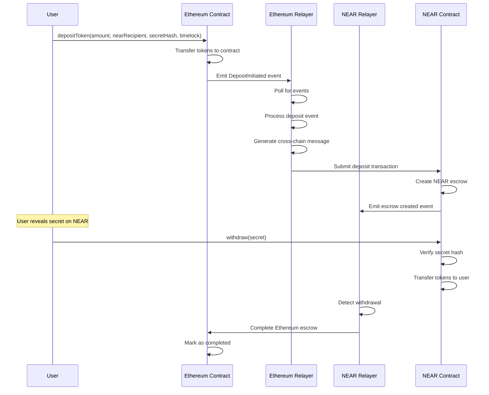
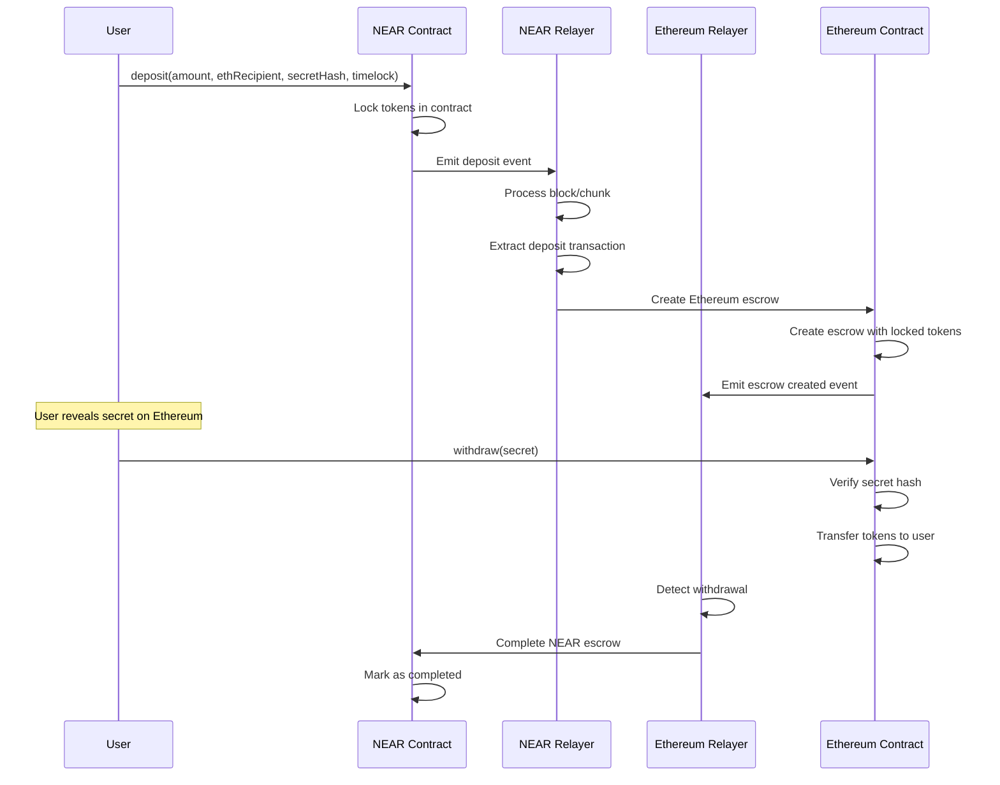
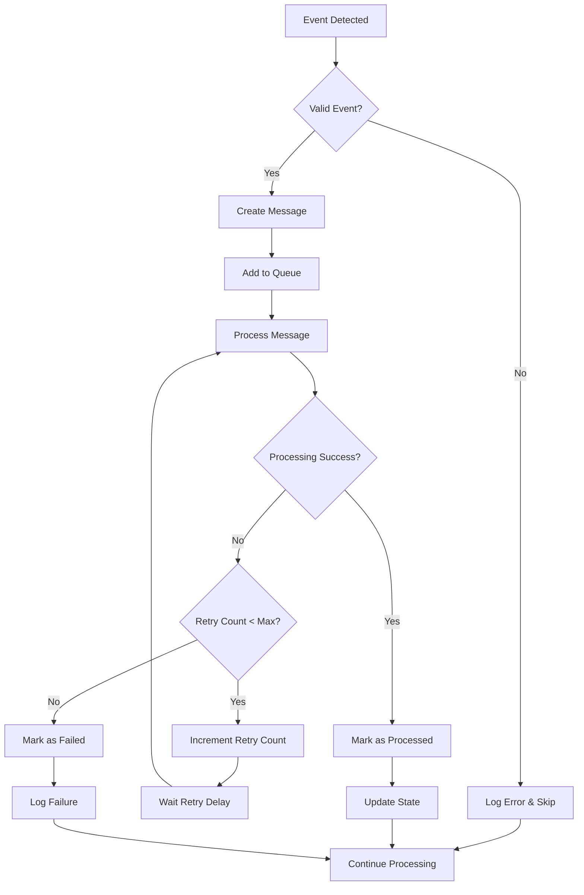

# Relayer Configuration and Flows Guide

## Configuration Overview

The Cross-Chain Relayer system requires careful configuration to ensure secure and reliable operation between Ethereum and NEAR networks. This guide covers all configuration options, deployment scenarios, and operational flows.

## Environment Configuration

### Required Environment Variables

```bash
# Ethereum Network Configuration
ETHEREUM_RPC_URL=https://eth-mainnet.alchemyapi.io/v2/YOUR_API_KEY
ETHEREUM_CHAIN_ID=1                    # 1 for mainnet, 11155111 for sepolia
DEPLOYER_PRIVATE_KEY=0x...             # Relayer's Ethereum private key

# NEAR Network Configuration
NEAR_NETWORK=mainnet                   # mainnet, testnet, or localnet
NEAR_NODE_URL=https://rpc.mainnet.near.org
NEAR_WALLET_URL=https://wallet.near.org
NEAR_HELPER_URL=https://helper.near.org
NEAR_ACCOUNT_ID=your-relayer.near      # Relayer's NEAR account
NEAR_PRIVATE_KEY=ed25519:...           # Relayer's NEAR private key

# Contract Addresses
RESOLVER_ADDRESS=0x...                 # Ethereum resolver contract
ESCROW_FACTORY_ADDRESS=0x...           # Ethereum escrow factory
NEAR_ESCROW_CONTRACT_ID=escrow.near    # NEAR escrow contract

# Relayer Operation Settings
RELAYER_POLL_INTERVAL=5000             # Polling interval in milliseconds
MAX_RETRIES=3                          # Maximum retry attempts
RETRY_DELAY=5000                       # Delay between retries (ms)
MESSAGE_EXPIRY=604800                  # Message expiry time (seconds)

# Server Configuration
PORT=3000                              # HTTP server port
LOG_LEVEL=info                         # debug, info, warn, error
NODE_ENV=production                    # development, production
```

### Network-Specific Configurations

#### Mainnet Configuration
```bash
# Ethereum Mainnet
ETHEREUM_RPC_URL=https://eth-mainnet.alchemyapi.io/v2/YOUR_KEY
ETHEREUM_CHAIN_ID=1

# NEAR Mainnet
NEAR_NETWORK=mainnet
NEAR_NODE_URL=https://rpc.mainnet.near.org
```

#### Testnet Configuration
```bash
# Ethereum Sepolia
ETHEREUM_RPC_URL=https://eth-sepolia.g.alchemy.com/v2/YOUR_KEY
ETHEREUM_CHAIN_ID=11155111

# NEAR Testnet
NEAR_NETWORK=testnet
NEAR_NODE_URL=https://rpc.testnet.near.org
NEAR_WALLET_URL=https://wallet.testnet.near.org
NEAR_HELPER_URL=https://helper.testnet.near.org
```

#### Local Development
```bash
# Local Ethereum (Anvil/Hardhat)
ETHEREUM_RPC_URL=http://localhost:8545
ETHEREUM_CHAIN_ID=31337

# NEAR Localnet
NEAR_NETWORK=localnet
NEAR_NODE_URL=http://localhost:3030
```

## Operational Flows

### 1. Ethereum to NEAR Swap Flow



### 2. NEAR to Ethereum Swap Flow



### 3. Message Processing Flow



## Relayer State Management

### 1. Message States

```typescript
enum MessageStatus {
  PENDING = 'pending',       // Message created, awaiting processing
  PROCESSING = 'processing', // Currently being processed
  PROCESSED = 'processed',   // Successfully processed
  FAILED = 'failed',         // Failed after max retries
  EXPIRED = 'expired'        // Expired before processing
}
```

### 2. State Persistence

```typescript
interface RelayerState {
  lastProcessedBlock: {
    ethereum: number;
    near: number;
  };
  processedMessages: Set<string>;
  failedMessages: Map<string, {
    error: string;
    retryCount: number;
    lastAttempt: number;
  }>;
  relayerStatus: {
    ethereum: boolean;
    near: boolean;
  };
}
```

### 3. Recovery Mechanisms

```typescript
// On startup, recover from last known state
async function recoverState(): Promise<void> {
  // Load last processed blocks
  const lastEthBlock = await loadLastProcessedBlock('ethereum');
  const lastNearBlock = await loadLastProcessedBlock('near');
  
  // Load processed message IDs
  const processedMessages = await loadProcessedMessages();
  
  // Resume processing from last known state
  await resumeProcessing(lastEthBlock, lastNearBlock, processedMessages);
}
```

## Security Configuration

### 1. Private Key Management

```bash
# Use environment variables for private keys
DEPLOYER_PRIVATE_KEY=0x...

# Or use key files (more secure)
ETHEREUM_KEYFILE_PATH=/secure/path/to/ethereum.key
NEAR_KEYFILE_PATH=/secure/path/to/near.key

# Use hardware security modules in production
HSM_ETHEREUM_KEY_ID=ethereum-relayer-key
HSM_NEAR_KEY_ID=near-relayer-key
```

### 2. Network Security

```bash
# Use secure RPC endpoints
ETHEREUM_RPC_URL=https://secure-rpc.example.com
NEAR_NODE_URL=https://secure-near-rpc.example.com

# Configure TLS certificates
TLS_CERT_PATH=/path/to/cert.pem
TLS_KEY_PATH=/path/to/key.pem

# Enable request authentication
API_KEY=your-secure-api-key
JWT_SECRET=your-jwt-secret
```

### 3. Access Control

```typescript
// Configure relayer permissions
const RELAYER_CONFIG = {
  allowedOrigins: ['https://app.example.com'],
  rateLimiting: {
    windowMs: 15 * 60 * 1000, // 15 minutes
    max: 100 // limit each IP to 100 requests per windowMs
  },
  authentication: {
    required: true,
    methods: ['jwt', 'api-key']
  }
};
```

## Monitoring Configuration

### 1. Health Checks

```typescript
// Health check endpoints
const healthChecks = {
  '/health': basicHealthCheck,
  '/health/ethereum': ethereumHealthCheck,
  '/health/near': nearHealthCheck,
  '/health/deep': comprehensiveHealthCheck
};

async function basicHealthCheck(): Promise<HealthStatus> {
  return {
    status: 'healthy',
    timestamp: new Date().toISOString(),
    uptime: process.uptime(),
    version: process.env.npm_package_version
  };
}
```

### 2. Metrics Collection

```typescript
// Prometheus metrics
const metrics = {
  messagesProcessed: new Counter({
    name: 'relayer_messages_processed_total',
    help: 'Total number of messages processed',
    labelNames: ['chain', 'status']
  }),
  
  processingDuration: new Histogram({
    name: 'relayer_processing_duration_seconds',
    help: 'Time spent processing messages',
    labelNames: ['chain', 'message_type']
  }),
  
  activeConnections: new Gauge({
    name: 'relayer_active_connections',
    help: 'Number of active blockchain connections',
    labelNames: ['chain']
  })
};
```

### 3. Alerting Rules

```yaml
# Prometheus alerting rules
groups:
  - name: relayer.rules
    rules:
      - alert: RelayerDown
        expr: up{job="relayer"} == 0
        for: 1m
        labels:
          severity: critical
        annotations:
          summary: "Relayer is down"
          
      - alert: HighErrorRate
        expr: rate(relayer_messages_processed_total{status="failed"}[5m]) > 0.1
        for: 2m
        labels:
          severity: warning
        annotations:
          summary: "High error rate in message processing"
          
      - alert: ProcessingDelay
        expr: relayer_processing_duration_seconds{quantile="0.95"} > 30
        for: 5m
        labels:
          severity: warning
        annotations:
          summary: "Message processing is slow"
```

## Deployment Configurations

### 1. Docker Configuration

```dockerfile
# Dockerfile
FROM node:18-alpine

WORKDIR /app
COPY package*.json ./
RUN npm ci --only=production

COPY . .
RUN npm run build

EXPOSE 3000
CMD ["npm", "start"]
```

```yaml
# docker-compose.yml
version: '3.8'
services:
  relayer:
    build: .
    ports:
      - "3000:3000"
    environment:
      - NODE_ENV=production
    env_file:
      - .env
    volumes:
      - ./logs:/app/logs
    restart: unless-stopped
    
  prometheus:
    image: prom/prometheus
    ports:
      - "9090:9090"
    volumes:
      - ./monitoring/prometheus.yml:/etc/prometheus/prometheus.yml
      
  grafana:
    image: grafana/grafana
    ports:
      - "3001:3000"
    environment:
      - GF_SECURITY_ADMIN_PASSWORD=admin
    volumes:
      - grafana-storage:/var/lib/grafana

volumes:
  grafana-storage:
```

### 2. Kubernetes Configuration

```yaml
# k8s-deployment.yaml
apiVersion: apps/v1
kind: Deployment
metadata:
  name: cross-chain-relayer
spec:
  replicas: 3
  selector:
    matchLabels:
      app: cross-chain-relayer
  template:
    metadata:
      labels:
        app: cross-chain-relayer
    spec:
      containers:
      - name: relayer
        image: cross-chain-relayer:latest
        ports:
        - containerPort: 3000
        env:
        - name: NODE_ENV
          value: "production"
        envFrom:
        - secretRef:
            name: relayer-secrets
        resources:
          requests:
            memory: "256Mi"
            cpu: "250m"
          limits:
            memory: "512Mi"
            cpu: "500m"
        livenessProbe:
          httpGet:
            path: /health
            port: 3000
          initialDelaySeconds: 30
          periodSeconds: 10
        readinessProbe:
          httpGet:
            path: /health
            port: 3000
          initialDelaySeconds: 5
          periodSeconds: 5
---
apiVersion: v1
kind: Service
metadata:
  name: relayer-service
spec:
  selector:
    app: cross-chain-relayer
  ports:
  - port: 80
    targetPort: 3000
  type: LoadBalancer
```

### 3. Production Checklist

- [ ] Environment variables configured
- [ ] Private keys securely stored
- [ ] RPC endpoints tested and reliable
- [ ] Monitoring and alerting set up
- [ ] Backup and recovery procedures tested
- [ ] Security audit completed
- [ ] Load testing performed
- [ ] Documentation updated
- [ ] Team trained on operations
- [ ] Incident response plan ready

## Troubleshooting Guide

### Common Configuration Issues

1. **Invalid Private Keys**
   ```bash
   Error: Invalid private key format
   Solution: Ensure keys are in correct format (0x... for Ethereum, ed25519:... for NEAR)
   ```

2. **RPC Connection Failures**
   ```bash
   Error: Connection timeout to RPC endpoint
   Solution: Check network connectivity and RPC endpoint status
   ```

3. **Contract Address Mismatches**
   ```bash
   Error: Contract not found at address
   Solution: Verify contract addresses match deployed contracts
   ```

### Performance Tuning

```bash
# Increase polling frequency for faster processing
RELAYER_POLL_INTERVAL=1000

# Adjust retry parameters for better reliability
MAX_RETRIES=5
RETRY_DELAY=3000

# Optimize block processing
BLOCK_LOOKBACK=50
MAX_PARALLEL_BLOCKS=10
```

### Debugging Commands

```bash
# Check configuration
curl http://localhost:3000/config

# View current status
curl http://localhost:3000/status

# Get metrics
curl http://localhost:3000/metrics

# Test connectivity
curl http://localhost:3000/health/deep
```

This comprehensive configuration guide ensures proper setup and operation of the cross-chain relayer system for secure and reliable Ethereum-NEAR communication.
